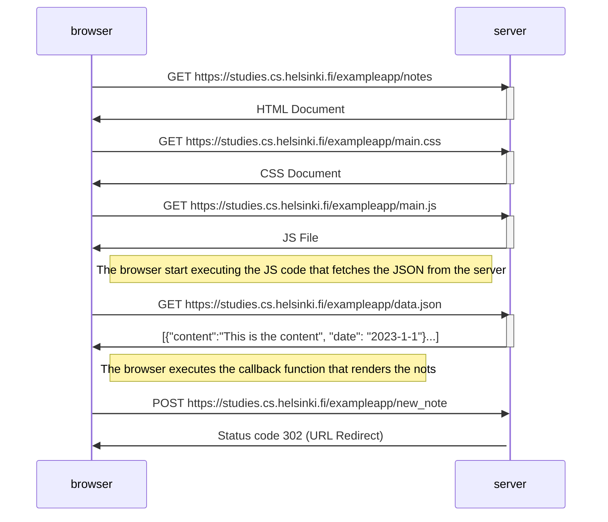

<!-- This sequence diagrams depicts for the creation of new notes on page https://studies.cs.helsinki.fi/exampleapp/notes-->

```mermaid
sequenceDiagram

    participant browser
    participant server

    browser ->>server: GET https://studies.cs.helsinki.fi/exampleapp/notes
    activate server
    server ->>browser: HTML Document
    deactivate server

    browser ->>server: GET https://studies.cs.helsinki.fi/exampleapp/main.css
    activate server
    server ->>browser: CSS Document 
    deactivate server


    browser ->>server: GET https://studies.cs.helsinki.fi/exampleapp/main.js
    activate server
    server ->>browser: JS File
    deactivate server

    Note right of browser: The browser start executing the JS code that fetches the JSON from the server

    browser ->>server: GET https://studies.cs.helsinki.fi/exampleapp/data.json
    activate server
    server ->>browser: [{"content":"This is the content", "date": "2023-1-1"}...]
    deactivate server

    Note right of browser: The browser executes the callback function that renders the nots

    browser ->>server: POST https://studies.cs.helsinki.fi/exampleapp/new_note
    activate server
    server ->> browser: Status code 302 (URL Redirect)


``` 

